<h1 align="center">Secret Chat Through Telegram Using Terminal</h1>

<p align="center">
    <i>A lightweight terminal based Encrypted Telegram chat tool for privacy focused conversations in crowd.</i>
</p>

---

## **About**

Have you ever needed to talk to someone privately, but the environment around you made it impossible?  
Maybe coworkers are nearby, or someone is trying to overhear your conversations.

I personally faced these situations many times  especially at my workplace Personal chat restriction rule.

**This tool solves that problem** by letting you chat directly through your **Windows Terminal** using the Telegram Open API.

Although targeted for **Windows users**, it works on **any OS** with Python installed (And install required librarys manually.)

You can run:

- The Python script manually after required library installation  
- Or install it globally using the provided batch installer (Windows) 
- Or create your own symbolic-link based binary for quick launching

---

## **Installation (Windows)**

### **Automated Installation batchscript (Recommended)**

Run the batchscript install.bat:

### **Steps**

1. Place **mewchat.py** and **install.bat** in the **same folder**.  
2. Double-click **install.bat**.  
3. Follow the instructions in the terminal.  
4. After installation completes, press **Enter** to close the terminal. 
---
<p align="center">
  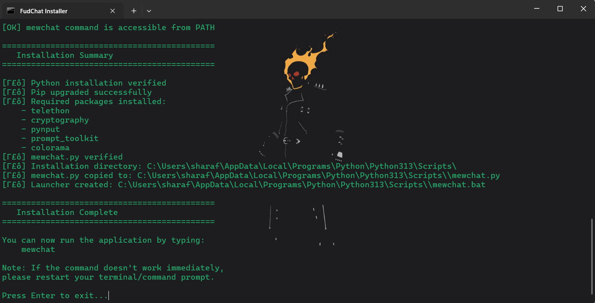
</p>

---

5. Open a **new Windows Terminal** window. and type mewchat & hit Enter to start mewchat
---


## 🔑 **Using Telegram Open API**  
### *How to Get Your Telegram API ID and API Hash*

1. Visit: **https://my.telegram.org**  
2. Log in with your phone number.  
3. Click on **“API Development Tools”**.
---
<p align="center">
  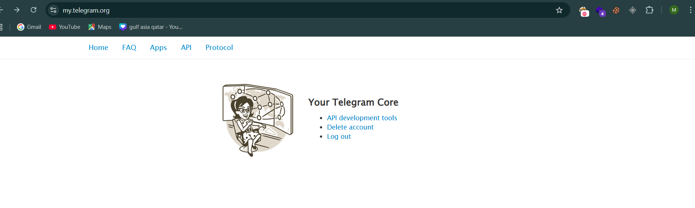
</p>

---

4. Fill the basic form:  
   - **App name** → required  
   - **Short name** → required  
   - *(Everything else like URL/Description can be left empty)*  
5. After creating the app, your **API ID** and **API Hash** will appear.

---
<p align="center">
  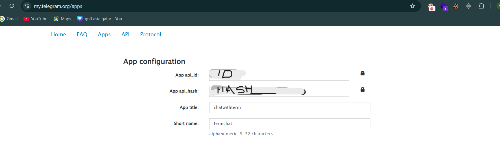
</p>

---
These two values are required the first time you run `mewchat`.

---

## 🚀 **Usage**

After installation,close installer, open new windows terminal & run : **mewchat**

---
<p align="center">
  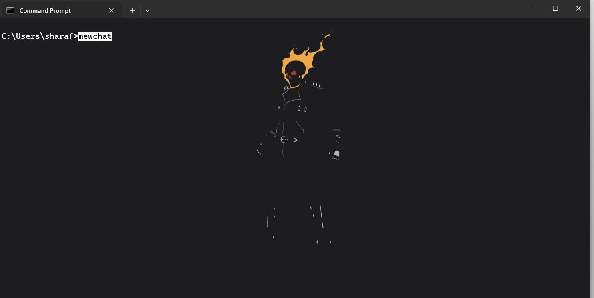
</p>

---
At first launch, the tool will ask for:

- Your **Telegram API ID**  
- Your **Telegram API Hash**
- Your **Telegram Account Phone Number**
Then verify with otp successfully logged in and Make connected with your tg account And api Creds 

---
<p align="center">
  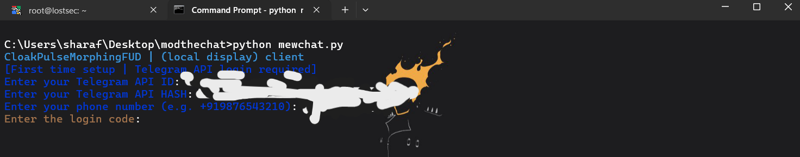
</p>
---
## Login & First-Time Setup

After entering your **API ID** and **API Hash**, the tool will guide you through Telegram login:

1. You will be prompted to enter your **phone number in international format**  
   Example:  +919876543210
2. Enter the OTP you receive on Telegram.
3. Once authenticated, the tool will ask you to:
- **Type a username, phone number or search by name**  
  *(Name search only checks **your chat history**, not global Telegram this prevents sending messages to the wrong person.)*
4. After selecting the person you want to chat with, it will prompt for a **passphrase**.
---
<p align="center">
  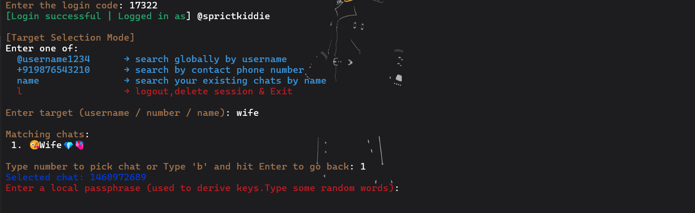
</p>

---

### 🔐 About the Passphrase

- This passphrase is used only for **key derivation** to encrypt/decrypt chat content.  
- It can be *anything* just random characters, words, whatever.
- Your chat window content is locally encrypted using **AES symmetric encryption**.
- Your messages decrypt only when **you decide**, and are automatically re-encrypted after **10 seconds**.

After entering your passphrase, you will enter the chat interface.

---

## 💬 How to Chat

### **Sending Messages**

Type your message wrapped in **double quotes**:**"Hello howe are you"**

---
<p align="center">
  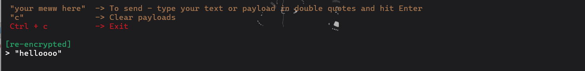
</p

---
Press **Enter** to send.

- **Your messages appear in green** (encrypted view) 

---
<p align="center">
  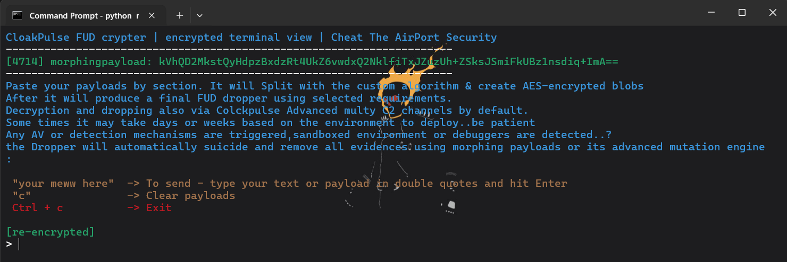
</p>

---
- **Incoming messages appear in red** (encrypted view)
---
<p align="center">
  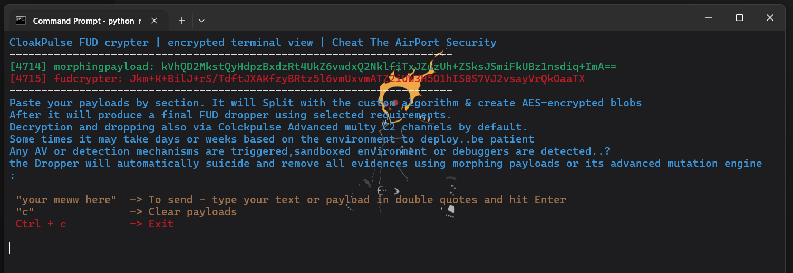
</p>

---

### **What is happening**
They can receive your messages through Telegram and reply to you normally. Basically, you are still chatting on Telegram, but through the terminal. The tool uses the Telethon Python library, which is designed to build applications that interact with Telegram via the official Open API. This chat system is built using python & Telethon library to log in to your Telegram account, fetch chats, and send replies that’s the concept. Your partner can chat using the normal Telegram app, or they can also use this terminal application if they want.

---
<p align="center">
  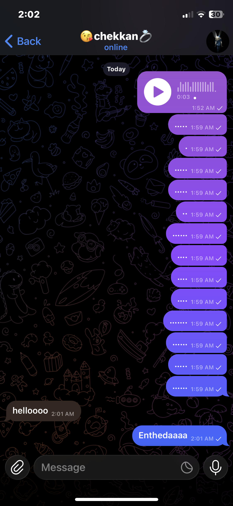
</p>

---
### **Decrypting Messages Temporarily**

To decrypt and read the conversation clearly: **d**
Press **Enter** → The chat view decrypts for **10 seconds**, allowing you to read it.

---
<p align="center">
  
</p>

<p align="center">
  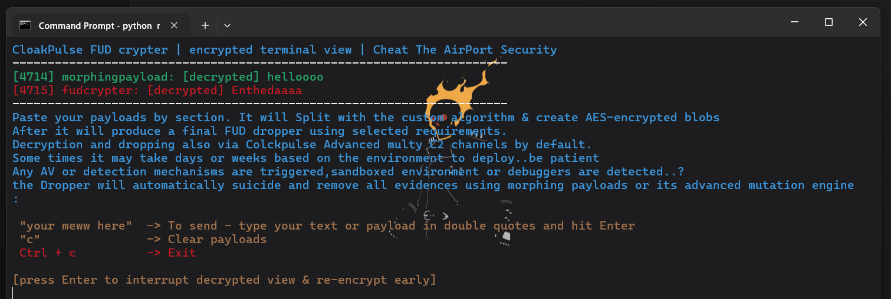
</p>

---

If someone suddenly comes near you: press **Enter** again

- Press **Enter** (empty line) immediately to **instantly re-encrypt** everything.
- **The system will also auto encrypt the view after 10 seconds on its own.**

### Extended decrypt

To Decrypt last 10 messeges for 15 seconds: **dd**
Press **Enter** → The chat view decrypts last 10 chats for **15 seconds**
- Press **Enter** immediately to **instantly re-encrypt** everything before 15 seconds auto Encrypting.(same like **d**)

---
### **Why This Matters**

The terminal interface intentionally mimics like *a serious automation tool created a IT professional for his work*    
so anyone glancing at your screen thinks you're doing some deep serious activity.  
But in reality… you're just chatting with your person safely.

---

## **This ensures:**
- No one around you can read the conversation  
- Contents stay encrypted unless temporarily decrypted(if someone suddenly captured photo encrypted view.they cant decrypt it without key) 
- Messages self protect automatically  
- The UI disguises itself as a harmful technical script

---

## Other Chat Commands & Features

### 🔄 Fetch Recent Messages

You can quickly clear the screen and reload recent chats directly from Telegram.

- Fetch **last 5 messages**:
Type **f** and hit **Enter**

---
<p align="center">
  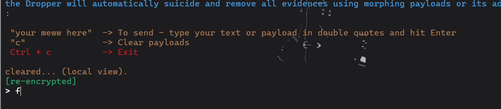
</p>

---
<p align="center">
  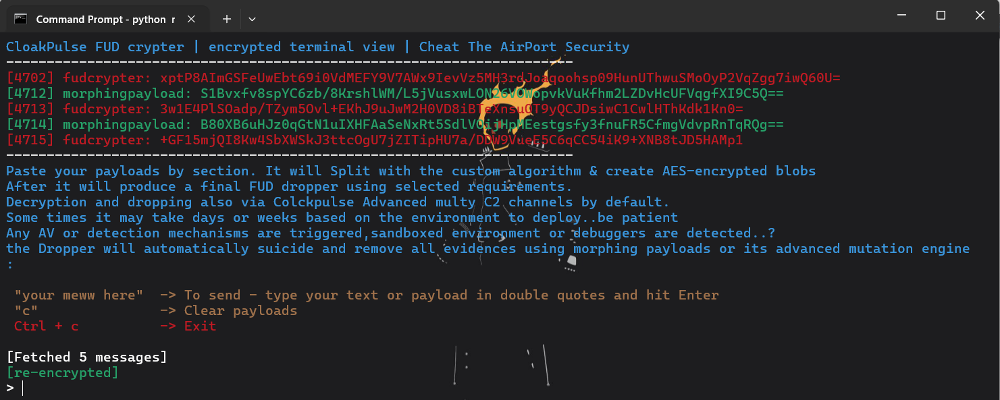
</p>

---
<p align="center">
  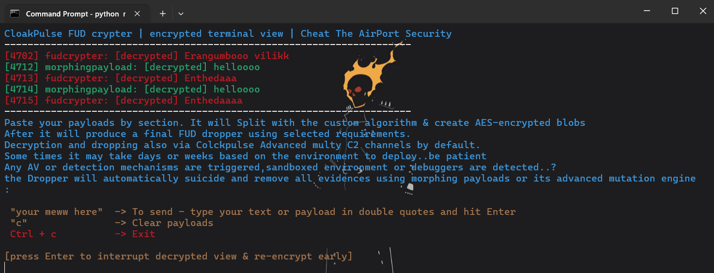
</p>

---
- Expanded Fetch **last 10 messages**:
Type **ff** and hit **Enter**


This clears the terminal view and reloads the latest sent/received messages for quick reference.

---

## Media Viewer (Images, Videos, GIFs, Audio)

If the person you are chatting with sends **any media** (image, video, gif, audio) through Telegram:

1. The tool **automatically downloads** the media.

---
<p align="center">
  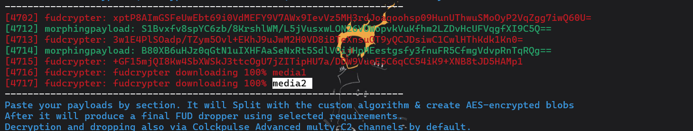
</p>

---
2. It assigns names like: **media1 ,media2**..etc

3. You will see a notification in the terminal when new media is saved e.g "**downloading 100% media7**".

### ▶️ View Media

To open and view the downloaded media: type **v medianame**(e.g media1) hit Enter

---
<p align="center">
  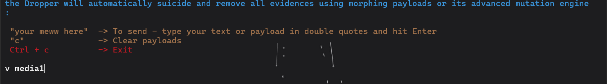
</p>

---

Press **Enter**, and your **default browser** will open automatically, displaying the media perfectly.

---
<p align="center">
  
</p>

<p align="center">
  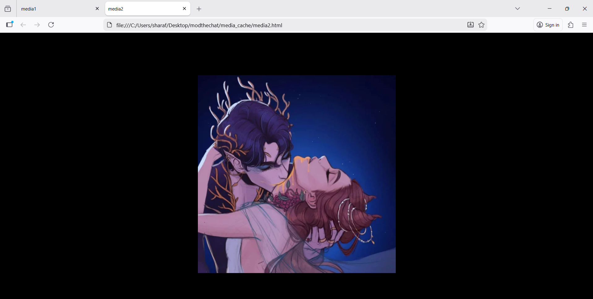
</p>

---
### Media Storage Limit

For privacy and safety, the application keeps **only the last 10 media files**.

- When media11 arrives:
  - All previous 10 media files are deleted.
  - Naming restarts from:
    ```
    media1
    ```

This cause old media cannot be accessed,but it built for maintaining secrecy during important situations purpose.

---

## Switch to Another Chat

To change the person you are chatting with: type **q** and hit **Enter** to go back 

Search for another user, pick a chat > Enter pasphrase start chat with that new person

From there you can:

- Search by **username**
- Search by **name** (limited to your chat history)
- Enter a **phone number**
- Pick any matching contact  
- Enter a **new passphrase**  
- Start chatting again with the same encrypted workflow

You can chat securely with **any of your Telegram contacts**.

---
<p align="center">
  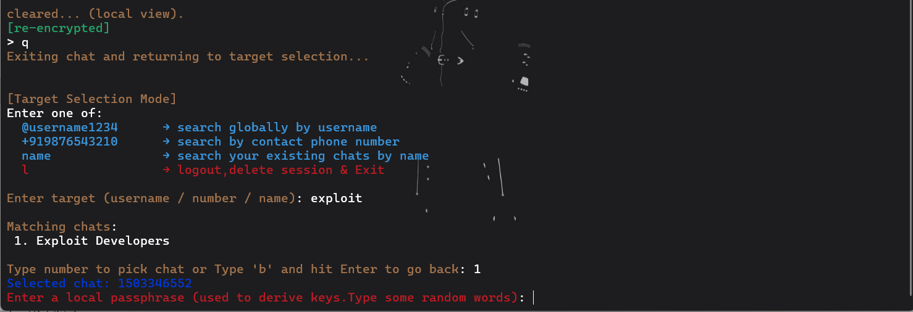
</p>

---

## Tamper Mode (Fun Security Trick)

### Tamper the Chat View

If someone nearby acts too curious and demands,  
**“Press d and show me what you're reading!”**  
— you have a secret trick.

Type: **t** and hit **Enter**

---
<p align="center">
  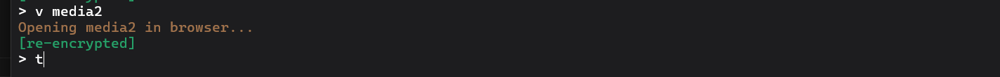
</p>

---
### What It Does

- It **scrambles (swaps bytes)** of all encrypted blobs displayed in your terminal.
- After tampering:
  - `d` → fails to decrypt  
  - `dd` → fails to decrypt  
- The encrypted text becomes unreadable even *with* the correct key and passphrase.
---
<p align="center">
  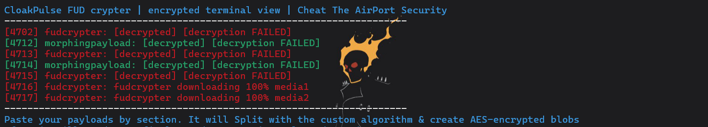
</p>

---

This creates the perfect illusion that:

- The chat was corrupted  
- The decryption is broken  
- Nothing meaningful was ever there  

### 🎭 Why This

It's a fun, harmless feature meant to:

- Mislead overly curious friends  
- Confuse nosy coworkers  
- Shut down “Sherlock Holmes” types  
- Make kids who think they “caught you” suddenly confused

Just a playful trick built into the system —  
**ahhhaaa…**

(Once you reload or fetch fresh chat, the view returns to normal.)

---

## Exit the Application

At any time, press: **Ctrl + c**


